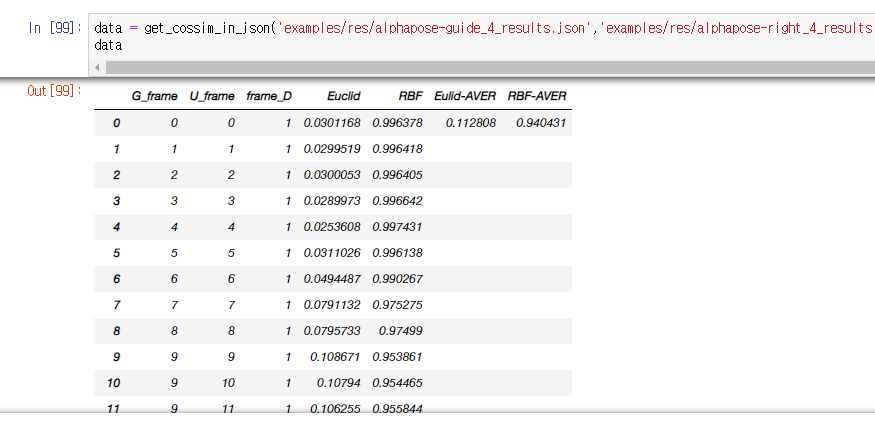
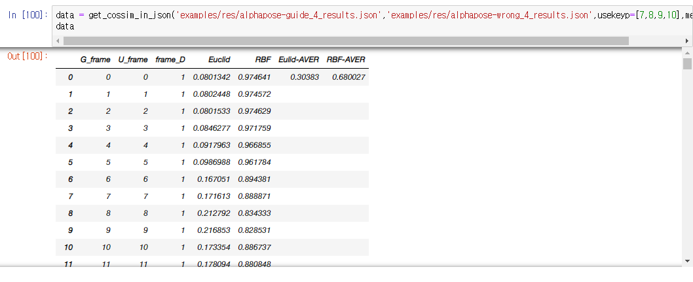
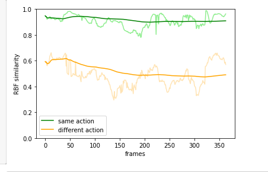

# video_pose_similarity_pangpang
Pose similarity between two videos

<h3>Information</h3>

  <h3>It's a similar move, but there's a time difference</h3>

  

  <h3>Quite a different move</h3>

  

  <h3>Result graph</h3>

  

# need
Alphapose

# what coding
Coding everything

# Production period
2022 5 8 ~ 2022 6 30  
