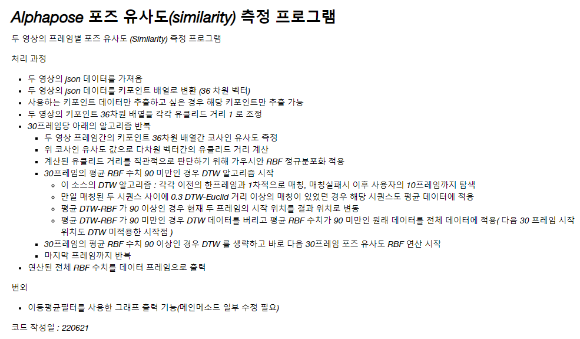

# video_pose_similarity_pangpang
Pose similarity between two videos

<h3>Information</h3>

  <h3>Relatively correct front and side photography test</h3>

  

  <h4>Picture example</h4>

  

  <h4>Result</h4>

  

  <h3>Relatively incorrect front and side photography test</h3>

   

  <h4>Picture example</h4>

  

  <h4>Result</h4>

  

# need
Nothing

# what coding
Coding everything

# Production period
2022 12 16 ~ 2022 1 15  
